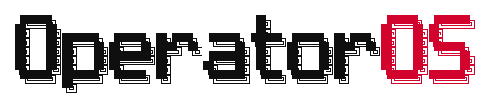

  <picture>
    <source media="(prefers-color-scheme: dark)" srcset="assets/operatoros-logo-white.png">
    
  </picture>

  <picture>
    <source media="(prefers-color-scheme: dark)" srcset="assets/wordmark-ansi-dark.png">
    
  </picture>

<h1 align="center">Operator Knowledge Base</h1>

Real AI systems, documented. The architecture, the guides, the skills, and the tools behind OperatorOS.

  <a href="https://operatoros.ai">operatoros.ai</a> ·
  <a href="https://instagram.com/daviss.dev">@daviss.dev</a> ·
  <a href="https://instagram.com/os.operator">@os.operator</a>

---

## What this is

Everything I ship on social traces back to systems I actually run. This repo is where those systems get documented properly: free, ungated, and at the level of design decisions rather than screenshots.

I'm Davis McMurrain. I run [OperatorOS](https://operatoros.ai), an AI systems agency. I build dashboards, AI operating systems, and self-hosted software stacks for real businesses, and I use the same architecture for my own operation. The content shows the builds. This knowledge base holds the substance so you can build your own.

Three commitments run through every page here:

1. **It exists in production.** Nothing is documented that does not actually run. Failure modes are included, because that is where the learning is.
2. **No invented numbers.** Costs, counts, and benchmarks come from real systems and real research passes, dated where it matters.
3. **Nothing gated.** No email wall, no course upsell. Star the repo and new material lands here before it hits the feed.

> [!NOTE]
> Client names, contract values, credentials, and server addresses are deliberately excluded everywhere. The architecture is the interesting part anyway.

---

## The map

### [ai-os/](ai-os/) The AI operating system

The system I actually run every day, not a rendered HTML page pretending to be Jarvis. Mail triage across three Gmail accounts, an agent-maintained knowledge vault, a chat agent with propose-only permissions, and a generated morning brief.

- **[architecture.md](ai-os/architecture.md)** The runtime. Two processes that only talk through Postgres, the actions table as an approval gate, Gmail triage design, model tiering, cron cadences, and the security posture.
- **[vault.md](ai-os/vault.md)** The agent-maintained Obsidian second brain. Split by mutability, the index/hot/log triad, frontmatter as a validated contract, and how autonomous enrichment stays bounded.
- **[claude-code-layer.md](ai-os/claude-code-layer.md)** Claude Code configured as a business operating system. The CLAUDE.md constitution, a 66-skill library, agent tiering, hooks, MCP lineup, and the memory pattern.
- **[build-your-own.md](ai-os/build-your-own.md)** The eight-stage build order, what to skip, and nine production failure modes with fixes.

### [dashboards/](dashboards/) Dashboard builds

The thesis in one line: a dashboard is a database with persistent memory, displayed properly. The front end is the window. The database is the thing.

- **[mission-control.md](dashboards/mission-control.md)** The agent mission control build. Five panels, three tables, from a free shadcn block to a live URL your agents write into on their own. One afternoon, zero dollars.
- **[patterns.md](dashboards/patterns.md)** The production patterns. Next.js, shadcn-only components, the data layer split, widget catalogs, SSE with polling fallback, pulled from a dashboard that ran more than 160 API routes and 36 panels.

### [stacks/](stacks/) The self-hosted stack

One Linux box, one public listener, everything else bound to loopback. The infrastructure that runs the marketing site, databases, automation workflows, and scheduled jobs for a flat monthly fee.

- **[self-hosted-stack.md](stacks/self-hosted-stack.md)** What runs on the box and why. Architecture, containers, reverse proxy and TLS, backups, and the honest cost picture.
- **[deploy-pattern.md](stacks/deploy-pattern.md)** Ship to a VPS step by step. Local gate, CI that validates but never deploys, one idempotent deploy script, a health gate that aborts bad releases.
- **[hardening-checklist.md](stacks/hardening-checklist.md)** The security posture in application order. Two firewall layers, SSH lockdown, container flags, secrets, and the outage that taught the loudest lesson.

### [guides/](guides/) Build guides

Full playbooks that originally shipped as gated Instagram lead magnets. Complete here, free here, kept current here.

- **[claude-code-skills-starter-kit/](guides/claude-code-skills-starter-kit/)** What Claude Code skills are, how they work, and five production-tested skills you can install in under a minute.
- **[claude-agents-guide/](guides/claude-agents-guide/)** The mental model for agents, working SKILL.md files, subagent patterns, the MCP servers to install first, and where it breaks in production.

### [skills/](skills/) Installable skills

Claude Code skills from my actual setup. Copy a folder into `~/.claude/skills/` and it runs, no restart needed. Currently: create, extract, research, recurring-report, swarm, system-design.

### [resources/](resources/) Tools with verdicts

The open source projects and tools I run or properly evaluated, including the rejections, which carry most of the decision value. Every entry gets a verdict that names the condition that would flip it.

- **[ai-and-agents.md](resources/ai-and-agents.md)** AI coding tools, agent frameworks, local inference.
- **[mcp-and-infra.md](resources/mcp-and-infra.md)** MCP servers, knowledge and memory tools, automation and infrastructure.
- **[media-and-frontend.md](resources/media-and-frontend.md)** Generation and media tools, image APIs, the frontend stack.

---

## Where to start

- **You want an AI OS that does real work.** Read [ai-os/build-your-own.md](ai-os/build-your-own.md) first, then the architecture when you want the reasoning.
- **You have never shipped a dashboard.** Go straight to [dashboards/mission-control.md](dashboards/mission-control.md). It is the honest minimum that still counts as real.
- **You want to own your infrastructure.** Start at [stacks/self-hosted-stack.md](stacks/self-hosted-stack.md) and do not point a domain at anything before the hardening checklist.
- **You are new to Claude Code.** The [skills starter kit](guides/claude-code-skills-starter-kit/) is the fastest on-ramp, and [skills/](skills/) gives you working examples to copy.

## The ideas that repeat

A few principles show up in every system here, because they keep earning their place:

- **The database is the message bus.** Processes coordinate through rows, not network calls. You get an audit trail for free and lose a whole class of auth problems.
- **Propose, then approve.** Agents suggest actions into a queue. A human approves. Autonomy is granted in layers, not assumed.
- **One public listener.** If a service does not need to be on the internet, it is not on the internet.
- **If a constraint matters, put it in code, not in a prompt.** Prompt rules drift. Enforcement does not.
- **Verdicts over ratings.** A useful tool opinion names the condition that would change it.

## How this grows

Every post that ships an artifact adds it here. Lead magnets from Instagram land as folders under `guides/`, build write-ups land in their pillar section, and new skills join the library. Watch or star the repo to catch material before it hits the feed.

## License

Code and skill files are MIT licensed. Use them, modify them, ship them. Written guides and documentation are free to read and share with attribution.

---

Built by OperatorOS · <a href="https://operatoros.ai">operatoros.ai</a>

