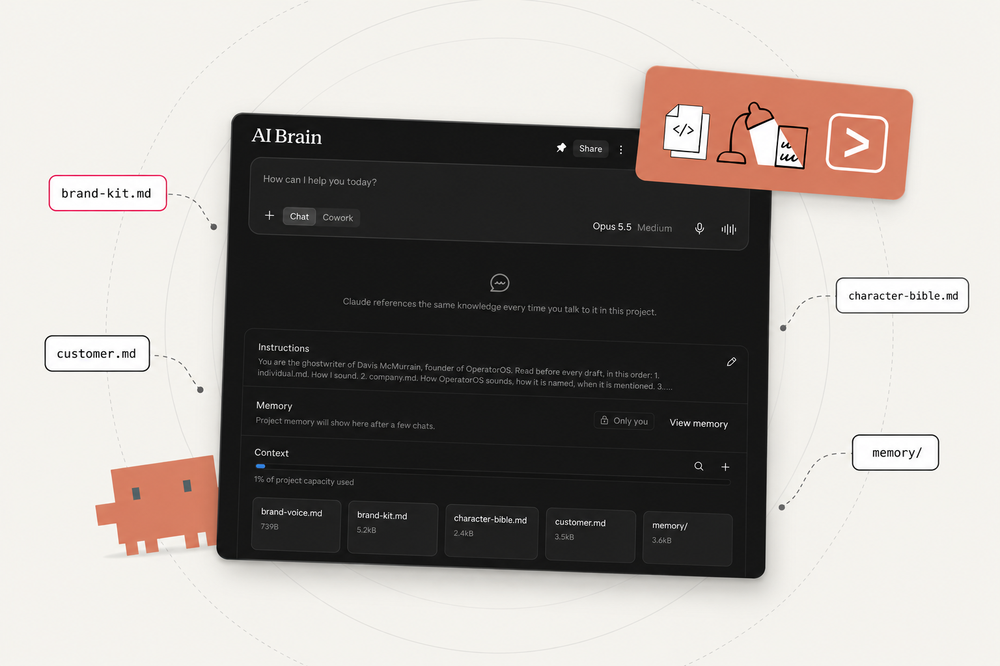
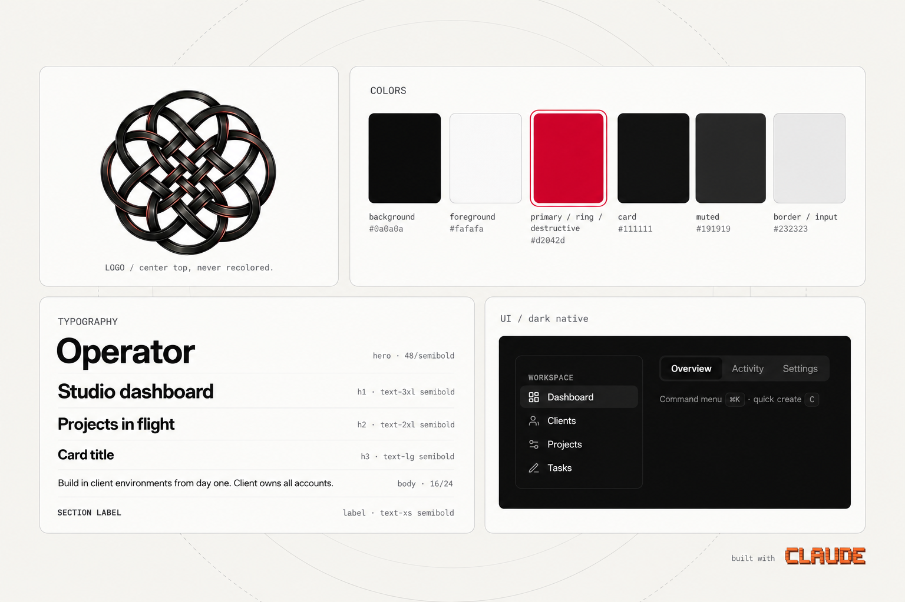
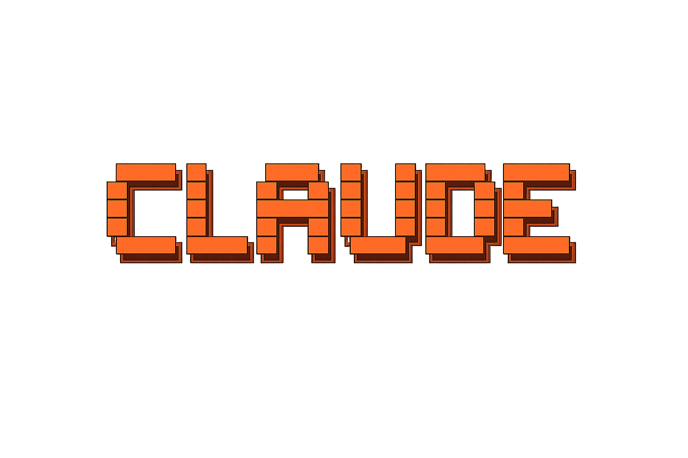
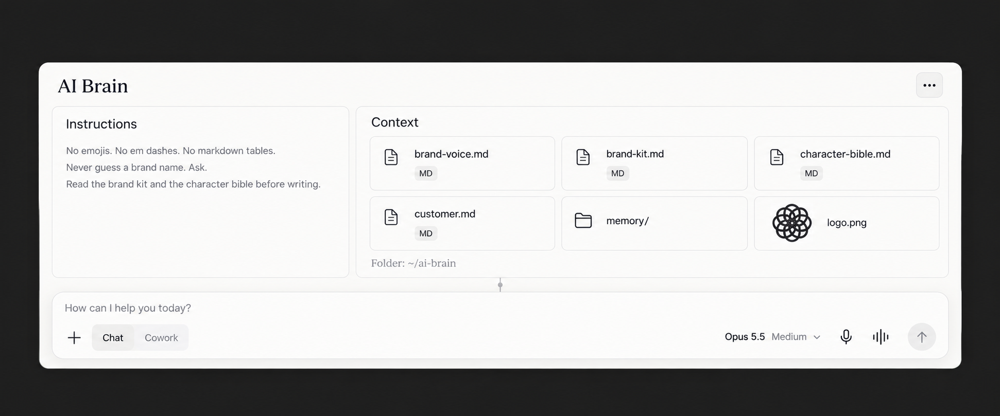

<p align="center">
  
</p>

# AI Brain

> Follow [@davis.mcm](https://instagram.com/davis.mcm) and [@os.operator](https://instagram.com/os.operator) on Instagram for more guides like this.

---

### One Claude project that writes in your voice, designs in your style, and knows your customer.

A Claude project is a folder of markdown. Open the desktop app, make a project, and everything you put in it is there at the start of every chat. You stop re-explaining yourself.

This is mine. The instructions, five files, and a folder of corrections. Every one is markdown. Every one has a prompt or a template that fills it from your own material, not from a description of yourself. This guide ships the folder, the prompts, the templates, and my filled examples.

---

## What you'll get

→ The project folder, copied to your machine with one command: instructions, five files, a memory folder, git history from the first second

→ The instructions I paste into every project, six rules that never bend

→ Two prompts that pull a brand voice file and a character bible out of writing you already have

→ A six-line customer template and a brand kit template with every field Claude needs to design in your palette

→ The memory file format for corrections, with the real one from my project

→ My filled brand voice, brand kit, and customer files as worked examples, and a four-case playbook for using the project

---

## Prerequisites

- The Claude desktop app, signed in. Projects are available on every plan, including free, which allows five of them ([help center](https://support.claude.com/en/articles/9517075-what-are-projects)).
- A folder of your own writing. Emails, call transcripts, proposals, captions. The two prompts read from it.
- Your logo as a PNG and your palette, if you have one. If not, the brand kit template walks you through deciding.
- git, so the folder has history. The script runs `git init` for you.
- Claude Code, optional. The same folder works there with no changes.

---

## Contents

1. [The project is a folder](#1-the-project-is-a-folder)
2. [Install](#2-install)
3. [The instructions](#3-the-instructions)
4. [brand-voice.md](#4-brand-voicemd)
5. [brand-kit.md](#5-brand-kitmd)
6. [character-bible.md](#6-character-biblemd)
7. [customer.md](#7-customermd)
8. [memory/](#8-memory)
9. [Set up the Claude project](#9-set-up-the-claude-project)
10. [Practical playbook](#10-practical-playbook)
11. [Keep it current](#11-keep-it-current)
12. [Troubleshooting](#12-troubleshooting)
13. [Quick reference](#13-quick-reference)
14. [Sources](#14-sources)

---

## 1. The project is a folder

Tone has layers. Who is talking, for which company, to which customer. One voice file cannot carry all of it, so the project splits them. Each layer is a file, and the instructions say what to read first.

```
~/ai-brain/
    INSTRUCTIONS.md        pasted into the project Instructions panel
    brand-voice.md         how the company sounds, how it is named, when it is mentioned
    brand-kit.md           palette, type, logo, accent rules
    character-bible.md     how you sound, pulled from your own writing
    customer.md            who the piece is for, in six lines
    memory/                one file per correction
        README.md          the index
        _template.md       copy to start a correction
    logo.png               your mark, next to the kit that describes it
    CLAUDE.md              so Claude Code reads the same rules
```

A project in the desktop app has three parts, and this folder feeds all three.

- **Instructions.** The rules every chat reads first. Banned words, format, what to read in which order. This is INSTRUCTIONS.md, pasted in.
- **Context.** The files. Brand voice, brand kit, character bible, customer, the corrections. Uploaded from this folder.
- **Folder.** The same files on your computer. Edit a file, re-upload it, done. Git keeps the history.

> [!NOTE]
> The help center calls the first one "project instructions" and the second the "project knowledge base". The panels in the desktop app read Instructions and Context. Same two things.

---

## 2. Install

```bash
git clone https://github.com/davisxai/operator-knowledge-base.git
bash operator-knowledge-base/guides/ai-brain/scripts/new-ai-brain.sh ~/ai-brain
```

The script copies `templates/ai-brain/` to `~/ai-brain`, stamps today's date into the memory index, and runs `git init` with a first commit. It refuses to overwrite a folder that already exists. Pass a different path as the first argument to put it somewhere else.

Then, in order:

1. Drop your logo in as `~/ai-brain/logo.png`.
2. Fill `brand-kit.md`. It is the one file that does not need a prompt. You know your hex codes. Section 5 covers each field.
3. Open the desktop app and build the project from the folder. Section 9.
4. Run the two prompts inside the project. The brand voice prompt is at the top of `brand-voice.md`, the character bible prompt at the top of `character-bible.md`.
5. Fill `customer.md`. Six lines.

The first correction arrives on its own, the first time a draft misses.

---

## 3. The instructions

Short and absolute. What is where, what never happens, and what to read first. Every chat in the project loads them before anything else.

Mine, as pasted:

```
No emojis.
No em dashes.
No markdown tables.
Never guess a brand name. Ask.
Read the brand kit and the character bible before writing.
Log every correction as a new file.
```

The template adds the read order above those six lines, so the instructions also say what is where. [templates/ai-brain/INSTRUCTIONS.md](templates/ai-brain/INSTRUCTIONS.md) is the full text. Replace the two bracketed names and paste it.

Rules go in the instructions. Everything else lives in a file. The split matters. A rule in the instructions is read before any file, so the things that must never happen cannot get buried in a long document. Everything with nuance, the tone, the palette, the customer, gets a file where it has room.

> [!TIP]
> **Keep the instructions under a screen.** If you are adding a paragraph, it belongs in a file, and the instructions should say which file to read.

---

## 4. brand-voice.md

The company gets its own voice. How it sounds, what it never says, how it is named, when it gets mentioned, and when it stays out. Every caption, deck, and page reads from it.

The reason it is separate from the character bible: you are who the reader follows, the brand is where the work happens. When those two blur, every post turns into a pitch. Two files, so the agent never confuses them.

The prompt, from the top of the template:

```
Here is [the site, the offer, ten client emails]. Write the brand voice file.
Cover: what we sound like, what we never say, how we are named, when the company is mentioned, when it stays out.
Pull every rule from the inputs. Quote the inputs as examples. Nothing I did not give you.
```

Attach the inputs and run it in a chat inside the project. Paste the output under the five headings in [templates/ai-brain/brand-voice.md](templates/ai-brain/brand-voice.md). Cut anything that is not true.

Mine is at [example/brand-voice.md](example/brand-voice.md). The naming section is the one people skip and the one that saves the most corrections. "OperatorOS", proper case, one word, never "Inc." after it. No model guesses that from a website.

---

## 5. brand-kit.md

<p align="center">
  
</p>

Claude designs in your style. Palette, fonts, accent rules, logo placement. Claude reads it before it designs a slide, a graphic, or a page, so every frame matches. Every slide in the carousel that sent you here was built from this file.

Field by field:

- **Colors.** Roles, then hex. Background, foreground, one primary, card, muted, border. The roles are the shadcn names, so the same file drives a UI theme and a slide deck.
- **Typography.** One display face. Hierarchy through weight. A scale from hero to label with size and weight on each line. Monospace named separately, with the rule for when it appears.
- **Logo.** The file name, the placement, and the two things that never happen: recolored, stretched.
- **Accent rule.** One accent word or phrase per frame in the primary color, never a paragraph. This one line is why the slides read as a set.
- **Backgrounds.** Light and dark surfaces, which one the cover uses, how they alternate.
- **Screenshots.** Real captures only. What gets rotated, shadowed, blurred.
- **UI.** Component library, radius, dark or light native.

Template: [templates/ai-brain/brand-kit.md](templates/ai-brain/brand-kit.md). Mine: [example/brand-kit.md](example/brand-kit.md).

> [!TIP]
> **Name the roles, not just the colors.** "#d2042d" tells Claude a color. "primary / ring / destructive: #d2042d" tells it where that color goes.

---

## 6. character-bible.md

The character bible, pulled from your own writing. Feed it the emails, call transcripts, and proposals you already wrote. It returns a voice profile: your tone, your phrasing, your rules. Mine is 1,841 words.

Extracted, not described. Describe your voice and you get the voice you think you have. Have Claude pull it from a few hundred emails and you get the one you actually use, with your own sentences as the examples.

The prompt:

```
Here are [emails, transcripts, proposals I wrote]. Build my character bible from them.
Cover: default tone, sentence structure, words I reach for, words I never use, how I open and close, how I handle objections, tone by context.
Rules: quote my own lines as examples. Nothing I did not write.
```

The two rules at the end do the work. Quoting your own lines keeps the profile honest. "Nothing I did not write" stops it from filling gaps with a generic founder voice.

What comes back goes under the headings in [templates/ai-brain/character-bible.md](templates/ai-brain/character-bible.md): default tone, sentence structure, words you reach for, words you never use, how you open and close, how you handle objections, tone by context. Read it once with a pen. Anything that is not you gets cut. Every chat in the project reads it before writing a word.

> [!TIP]
> **More inputs, fewer adjectives.** Ten emails produce a profile full of "confident" and "direct". A hundred produce the actual sentence patterns.

The example folder does not include my bible. It is the one file in the project that is only ever about one person, and the prompt above gives you yours.

---

## 7. customer.md

Your ICP, in one file. ICP is your ideal customer profile. It is more than demographics. It is what they build, what they want, and what they ignore.

The template, six lines:

```
01 WHO                [role] who builds with [tools].
02 STAGE              Has shipped [nothing / one thing / paid work].
03 WANTS              [the process or proof they are after].
04 RESPONDS TO        [the resource that maps a workflow].
05 NEVER RESPONDS TO  [hype, guru cadence, effortless outcomes].
06 NOT FOR            [the anti-persona].
```

Stage is the line that changes the writing most. The same topic for someone who has shipped nothing and for someone who already bills for the work is two different pieces. Every post picks one stage before a word is written, and the instructions tell Claude to do the same.

Line six exists so the piece stops trying to please everyone. Naming who it is not for is what lets the rest be specific.

Template: [templates/ai-brain/customer.md](templates/ai-brain/customer.md). Mine, three stages filled: [example/customer.md](example/customer.md).

---

## 8. memory/

Every correction becomes a file. When a draft misses, write the fix once. What went wrong, why, and how to apply it. Claude reads it before the next draft. I have 52.

The format, from the real one in my project:

```
# no-copywriter-cliches

- Rule:  Never use copywriter metaphors. State the literal claim.
- Why:   "rented land" made it into a script. I have never talked like that.
- Apply:
  - Strip metaphors before writing.
  - If you reach for one, write what it actually means.
  - Read out loud before delivering.
```

Three parts. The rule is one sentence. The why quotes the line that was wrong, because the quote is what stops the pattern from coming back in a different outfit. The apply section is what to do before, during, and after.

One file per correction, named after the rule. `memory/README.md` is the index, one line each. `memory/_template.md` is the blank. The instructions already say "log every correction as a new file", so in the chat where the miss happened you can just say "log it". Claude writes the file in the format. You add it to Context.

Say it once. The file remembers it for every chat after.

> [!TIP]
> **Log the rule, not the mood.** "Be more concise" is a mood. "Never apologize in a client email. Acknowledge the fact in one line, go to substance." is a rule the next draft can pass or fail.

---

## 9. Set up the Claude project

<p align="center">
  
</p>

In the desktop app, Projects sit in the left sidebar.

1. Click the plus next to Projects. Name it AI Brain.
2. Open Instructions. Paste the contents of `INSTRUCTIONS.md`, bracketed names replaced. Save.
3. Open Context. Add `brand-voice.md`, `brand-kit.md`, `character-bible.md`, `customer.md`, `logo.png`, and the files in `memory/`.
4. Keep `~/ai-brain` as the folder on disk. When a file changes, re-upload it.

<p align="center">
  
</p>

The desktop app can also create a project from an existing folder on your computer. That project stays on that machine, and Cowork sessions run against the folder directly. The help center's note on it: Cowork won't change a project's contents, so add anything you want to keep to the project yourself ([source](https://support.claude.com/en/articles/15520349-use-claude-cowork-on-web-desktop-and-mobile)). Either way, the folder on disk is the source, and Context holds the copies that chats read.

Start a chat inside the project and ask it to restate the rules in one line. If it names the six, the instructions are loaded. If it names the files it will read first, Context is loaded.

The same folder in Claude Code:

```bash
cd ~/ai-brain
claude
```

Claude Code reads `CLAUDE.md` on start. That file says to read `INSTRUCTIONS.md` first, then the files it lists. One folder, two surfaces, the same rules. For the longer version of running a whole operating layer this way, see [ai-os/claude-code-layer.md](../../ai-os/claude-code-layer.md), section 2 for the instructions file and section 7 for memory as a correction log.

---

## 10. Practical playbook

One project. Every chat starts there. Once the files are in, you stop prompting from scratch. Ask for the work and it comes back in your voice, your style, for your customer.

### Use Case 1: Ask for a caption

**Scenario:** A carousel is rendered and needs its caption.

**The prompt:**
```
Write the caption for the attached carousel. Customer stage: has shipped nothing.
```

**What happens:**
- Claude restates the six rules in one line, per the instructions.
- It reads character-bible.md for the sentence patterns, brand-voice.md for whether the company belongs in this piece at all, customer.md for the stage, memory/ for every logged miss.
- The draft comes back in your cadence, to one reader.

**Expected outcome:** A caption you edit for facts, not for voice.

> **Pro tip:** If the company shows up in the caption and is not doing work in the piece, that is a brand-voice.md fix, not a one-off edit.

### Use Case 2: Ask for a slide

**Scenario:** You need a cover slide, a one-pager, or a landing section, and it has to look like yours.

**The prompt:**
```
Design the cover slide for a carousel titled "[title]". Use brand-kit.md. One accent phrase.
```

**What happens:**
- Claude reads the palette roles, the type scale, the logo placement, and the accent rule.
- The layout comes back in your colors, with the logo where the kit says it goes and one phrase in the primary color.

**Expected outcome:** A frame that matches the last one without you naming a single hex code.

> **Pro tip:** When a frame comes back off-brand, a field is missing from the kit. Add the field, re-upload, ask again.

### Use Case 3: Ask for an email

**Scenario:** A client reply, a cold opener, an update to a team.

**The prompt:**
```
Draft a reply to [name] confirming Thursday's call and what I need from them before it. Short.
```

**What happens:**
- The bible sets the opener, the first sentence, the closing line, and the sign-off.
- The brand voice sets how the company is named, if it comes up.
- memory/ supplies every email rule you have logged.

**Expected outcome:** It opens with the point and signs off your way.

### Use Case 4: Correct it once

**Scenario:** A line in a draft is not you.

**The prompt:**
```
"Rented land" is a copywriter metaphor. I never talk like that. Log it.
```

**What happens:**
- Claude writes the correction in the memory format: rule, why with the quoted line, apply.
- You save it as `memory/no-copywriter-cliches.md`, add the index line, upload it to Context.
- The next draft reads it before writing.

**Expected outcome:** The fix becomes a file it reads next time. Build it once. Every chat after starts from it.

---

## 11. Keep it current

- **Edit on disk, re-upload.** The folder is the source. Context holds the copies. When a file changes, replace it in Context. Git has the history if you want to see what a rule used to say.
- **Corrections are the maintenance.** The bible and the kit change rarely. memory/ grows with every miss. Mine held 52 files on October 9, 2026, and the count is the point.
- **Re-run the bible when the inputs change.** A new kind of writing, a new channel, a year of emails the old profile never saw. Same prompt, more inputs, read the diff.
- **One customer file per customer.** If you write to two different people, make `customer-a.md` and `customer-b.md` and have the instructions say to pick one.

---

## 12. Troubleshooting

- **A rule keeps getting broken.** It is in a file, not in the instructions. Move it. Instructions load before anything else.
- **The output is generic.** The stage was not picked. Add it to the prompt, or have the instructions ask for it when it is missing.
- **The brand shows up as a pitch.** brand-voice.md is missing the "when it stays out" section, or it is empty. Fill it.
- **Designs drift.** A field is missing from brand-kit.md. The usual ones: the accent rule, logo placement, the alternation pattern.
- **A correction came back.** The file was written but never uploaded to Context, or the index line is there and the file is not. Check both.
- **Claude Code ignores the rules.** It was started outside the folder. `cd ~/ai-brain` first. CLAUDE.md is read from the directory you start in.

---

## 13. Quick reference

**Install**
```bash
git clone https://github.com/davisxai/operator-knowledge-base.git
bash operator-knowledge-base/guides/ai-brain/scripts/new-ai-brain.sh ~/ai-brain
```

**Read order** (from INSTRUCTIONS.md)
1. character-bible.md
2. brand-voice.md
3. brand-kit.md
4. customer.md
5. memory/

**The six rules**
No emojis. No em dashes. No markdown tables. Never guess a brand name, ask. Read the brand kit and the character bible before writing. Log every correction as a new file.

**The two prompts**
- Brand voice: top of `brand-voice.md`
- Character bible: top of `character-bible.md`

**The customer template**
WHO / STAGE / WANTS / RESPONDS TO / NEVER RESPONDS TO / NOT FOR

**Memory file**
Rule, one sentence. Why, with the quoted line. Apply: before, during, after. Named after the rule. Indexed in `memory/README.md`.

**Project setup**
Instructions: paste INSTRUCTIONS.md. Context: upload the four files, logo.png, and memory/. Folder: `~/ai-brain` on disk.

**Claude Code**
```bash
cd ~/ai-brain && claude
```

---

## 14. Sources

- Projects on every plan, five on free: Anthropic help center, [What are Projects?](https://support.claude.com/en/articles/9517075-what-are-projects)
- Creating a project, "Set project instructions", the project knowledge base: [How can I create and manage projects?](https://support.claude.com/en/articles/9519177-how-can-i-create-and-manage-projects)
- Projects tied to a local folder and the Cowork note: [Use Claude Cowork on web, desktop, and mobile](https://support.claude.com/en/articles/15520349-use-claude-cowork-on-web-desktop-and-mobile)
- The character bible word count and the memory file count were pulled from the files on my machine on October 9, 2026.
- The Claude Code side of the same idea, the instructions file and memory as a correction log: [ai-os/claude-code-layer.md](../../ai-os/claude-code-layer.md), sections 2 and 7.

---

Built by OperatorOS | [operatoros.ai](https://operatoros.ai)
Follow [@davis.mcm](https://instagram.com/davis.mcm) and [@os.operator](https://instagram.com/os.operator) for production-grade AI guides.
