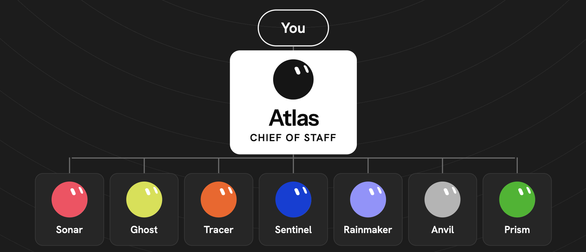

<p align="center">
  
</p>

# Grok Bot Founder Team

> Follow [@davis.mcm](https://instagram.com/davis.mcm) and [@os.operator](https://instagram.com/os.operator) on Instagram for more guides like this.

---

### From one catch-all bot to eight named bots with jobs, boundaries, and a build order.

Grok Bot gives you named agents that keep their memory, files, and logins between tasks and keep working on a cloud computer after you close the laptop. Most people make one and ask it for everything. This guide is the other way: a team of eight, each with a job description you can paste in, a folder it writes to, a line it never crosses, and a schedule. It covers the install, the operating model, the description field in detail, the full roster, the handoff rules, the routines, and the list of where it breaks.

It is not a review. Every claim about the product traces to xAI's docs or to a named independent test. Every number has a source at the bottom.

---

## What you'll get

→ The install, the sign-in, and your first bot in about fifteen minutes

→ The operating model every published Grok Bot team uses: one Chief of Staff, specialists for stable jobs, files for handoffs

→ The five things that go in a description field, and the three-section layout that keeps them straight

→ Eight paste-ready job descriptions: Atlas, Sonar, Ghost, Tracer, Sentinel, Rainmaker, Anvil, Prism

→ A voice file template, a handoff protocol, a routine text bank, and a set of auto-review rules

→ The build order, six worked workflows with the exact prompt, and the honest list of what fails

---

## Prerequisites

- A Cursor account on a paid individual plan ($20 a month as of September 30, 2026) or a Cursor Teams plan. SuperGrok, SuperGrok Plus, and SuperGrok Heavy subscribers link their subscription to a Cursor account. Grok Bot usage is its own allocation, separate from your Cursor and Grok plans, and it resets weekly.
- The Grok Bot desktop app for macOS, Windows, or Linux from [x.ai/bot](https://x.ai/bot). The iPhone and Android apps work for chat and approvals but you will do the setup on desktop.
- Somewhere your team already keeps its truth: a CRM, a repo, a tracker, a sheet. The bots read those. They do not replace them.
- Optional: Cursor cloud agents if you want Anvil, the builder bot, to hand off code.

---

## Contents

1. [What Grok Bot actually is](#1-what-grok-bot-actually-is)
2. [Install and first bot](#2-install-and-first-bot)
3. [The operating model](#3-the-operating-model)
4. [The job description](#4-the-job-description)
5. [The roster](#5-the-roster)
6. [Build order](#6-build-order)
7. [Handoffs](#7-handoffs)
8. [Routines and approvals](#8-routines-and-approvals)
9. [Six workflows](#9-six-workflows)
10. [Usage and cost](#10-usage-and-cost)
11. [Where it breaks](#11-where-it-breaks)
12. [Troubleshooting](#12-troubleshooting)
13. [Quick reference](#13-quick-reference)

---

## 1. What Grok Bot actually is

Grok Bot launched in beta on August 11, 2026. A Bot is a named agent with three fields: a name, a title, and a description. It keeps its memory, its files, and its browser logins from one task to the next. Give it a job and the tools it needs, and it works through multi-step tasks across apps and websites, then comes back when it needs an approval.

Three details from the docs matter more than the launch video.

**All of your bots share one cloud computer.** The launch post says "their own cloud-based computer." The docs are more precise: one computer per user account, and every bot on the account shares it. Each bot gets its own screen on that machine. Files, browser cookies, signed-in sessions, and command-line credentials are shared across all of them. Log into a site with one bot and every bot can reach it. That is useful for handoffs and it is the single biggest thing to design around.

**The work does not stop when you do.** From the overview: "Closing the app, your laptop, or your phone doesn't stop a background turn or a routine." A routine scheduled for 6:30 AM runs at 6:30 AM.

**Memory is a navigation aid, not a system of record.** A bot keeps "stable working preferences, important facts, and summaries from its work." The docs tell you to keep changing data in your source systems and to ask for citations on anything consequential. Flavio Copes, who ran a careful independent test, found old preferences sticking after he changed the rule and a local note quietly standing in for his real CRM. Design so that cannot matter: the CRM is the CRM, the repo is the repo, memory just helps the bot find them.

The rest of the surface, briefly:

- **Skills.** A reusable set of instructions for a task. You save one by asking: "Save the process we just used as a skill called 'Weekly account health.'" All your bots share one skill library. You call one with `/` in the composer.
- **Routines.** A schedule or an event trigger, owned by one bot. Up to 50 per bot. Test run does real work.
- **Connectors and plugins.** Installed from the Marketplace, account-wide. Attach one with `@`. Bots never hold your OAuth tokens. For a password, a two-factor code, or a CAPTCHA, the bot hands the computer to you.
- **Templates.** Share a bot as a recipe. It strips your memories, secrets, custom code, and private skills. Whoever adds it gets their own copy.
- **Team Bots** (September 28, 2026). One bot an owner sets up once and the whole team talks to, in the app or in Slack. Teams and Enterprise plans.

Adoption, for context: Bloomberg reported 418,000 weekly users as of September 14, 2026, up 24 percent week over week, citing a presentation at a London event.

---

## 2. Install and first bot

1. Download the desktop app from [x.ai/bot](https://x.ai/bot). Pick your architecture. It updates itself after that.
2. Open it and choose Sign in with Cursor. Finish the browser step. If you are on a SuperGrok plan, link it when prompted.
3. Press `Cmd/Ctrl+N` or click New in the sidebar, then Create new Bot. You get a bot called New Bot. Open the Bot menu, then Context. Set the name and title, and paste the job description into the Instructions box. The app may file parts of it as Memories on its own. That is fine.
4. Make the first one Atlas. Name: Atlas. Title: Chief of Staff. Description: paste [templates/bots/01-atlas-chief-of-staff.md](templates/bots/01-atlas-chief-of-staff.md), everything below the line.
5. Give it a first task in plain words: "Read my inbox from the last 24 hours and write the attention file to /workspace/atlas/attention.md. Do not send anything." It will ask for email access. Connect it through the Marketplace, or open Agent Computer and sign in yourself when the bot pauses on a login.
6. Read what it wrote. Correct anything wrong in chat. Those corrections are what its memory keeps.

The docs' own advice for this step: "Focused Bots build more useful context than one catch-all Bot." Do not make a General Helper. The docs name that exact anti-pattern and say it "gives the Bot less guidance and makes its saved context harder to reuse."

> [!TIP]
> **Start with a voice note.** xAI's own onboarding guide says to describe the workflow exactly as you would do it by hand, or record a demo on your screen. A bot that watched you do the thing once writes a better skill than a bot that read a paragraph about it.

---

## 3. The operating model

xAI has published fifteen guides for marketing, sales, support, engineering, recruiting, legal ops, product, and more. Strip the department labels off the team guides and they are all the same shape.

```
                        ┌──────────────┐
                        │   Founder    │  approves sends, spends, merges
                        └──────┬───────┘
                               │ one thread
                        ┌──────▼───────┐
                        │     Atlas     │  Chief of Staff
                        │ inbox, cal,  │  brief, attention list, routing
                        │ queue        │
                        └──────┬───────┘
          ┌────────┬───────┬───┴───┬────────┬────────┬────────┐
          ▼        ▼       ▼       ▼        ▼        ▼        ▼
       ┌─────┐ ┌─────┐ ┌──────┐ ┌─────┐ ┌──────┐ ┌─────┐ ┌─────┐
       │Sonar│ │ Ghost │ │Pipe- │ │Sentinel│ │Rainmaker│ │Anvil│ │Prism│
       │     │ │     │ │line  │ │     │ │      │ │     │ │     │
       └──┬──┘ └──┬──┘ └──┬───┘ └──┬──┘ └──┬───┘ └──┬──┘ └──┬──┘
          │       │       │        │       │        │       │
   ═══════╧═══════╧═══════╧════════╧═══════╧════════╧═══════╧═══════
                       /workspace  (one shared computer)
   ═══════════════════════════════════════════════════════════════════
```

Three rules hold it together.

**One bot is your single thread.** The marketing guide's Project Manager "studies the other bots, runs handoffs, and is my single thread." The PM guide's Chief of Staff is "the only generalist. Stays quiet if nothing changed." You talk to Atlas. Atlas talks to everyone else.

**Specialists own one stable job each.** The docs' team order: give one bot end-to-end ownership of something first. Add a specialist only when the role is stable. The marketing guide puts it bluntly: "A generalist chat that tries to do research, ads, and code in one thread gets bloated and forgets why you hired it."

**Handoffs go through files.** Copes found that open group chats led to bots repeating each other and spending usage debating instead of working. One bot writes a file to `/workspace`, the next bot reads it. Section 7 has the full protocol.

Copes adds a fourth rule this guide adopts everywhere: split the authority, not just the work. Interpretation (reading numbers), proposal (drafting), execution (acting inside a boundary), and spending live on different bots. The bot that reads the scoreboard never changes a budget based on it.

---

## 4. The job description

This is the part the template posts skip, and it is the whole game. The Instructions box (the docs call it the description) is permanent. It is the job description. The message you send is the task. From the docs: description fields hold "permanent rules and boundaries," messages hold "task-specific instructions."

Five things go in the description. Also from the docs, a good job has:

1. **A goal or area of ownership.** One sentence. "Own the weekly account-health review."
2. **A tool and source set.** Exactly which systems it reads and which it may write to.
3. **A working style.** How it compares, how it cites, how long its output is, what it does when a source is missing.
4. **An approval boundary.** The things it never does without you. "Never send external messages without approval."
5. **A recurring schedule.** When it runs on its own, if ever.

The docs' verbatim example of a strong description: "Own the weekly account-health review. Pull product usage and support signals, flag evidence of churn or expansion, and produce a linked watch list for the customer-success team."

To keep the five things from blurring together, every description in this guide uses the three-section layout Copes landed on:

```markdown
## Non-negotiable rules
The never list. Approval boundaries. Where it may write.

## The job
Ownership. Sources. How it works. Deliverables and where they land. Schedule. Style.

## Current assignment
Three lines, replaced whenever priorities change.
```

Words that do nothing: "be proactive," "be brilliant," "help me with anything." Copes tested them. They do not steer. Lines that do steer, from his working bot:

- "compare with the same weekday from four weeks prior, not yesterday"
- "add the exact source URL beside every number"
- "if analytics is unavailable, mark the section unavailable, do not fill from the previous report"
- "you may read connected systems; do not publish, push, send emails, or close issues without approval"

Every bot file in `templates/bots/` is built from lines like those.

> [!IMPORTANT]
> **Put the boundary in the Instructions, not the message.** A message is one task. If the never-send rule lives in a message, the next task does not have it. If it lives in the description, every task does.

---

## 5. The roster

Eight bots. Rename any of them. Keep the jobs. The one-page version with the authority split and the build order is [templates/roster.md](templates/roster.md). Each name links to its paste-ready description.

**[Atlas](templates/bots/01-atlas-chief-of-staff.md), Chief of Staff.** Owns the inbox, the calendar, the daily brief, the attention list, and the approval queue. Routes work to the other seven. Never sends, never moves a meeting, never invents an urgency. If nothing changed it says so in one line. Its brief has three sections: needs you, in motion, done.

**[Sonar](templates/bots/02-sonar-market-researcher.md), Market Researcher.** Owns the competitor watch. Reads a named list of competitors' pricing pages, changelogs, careers pages, social accounts, and public reviews, in that order of trust. Compares against last week's read, not against memory. Every claim has a link beside it. Never contacts anyone. Weekly read every Monday, sections: what changed, what it means, what we should test.

**[Ghost](templates/bots/03-ghost-writer.md), Writer.** Owns every draft in your voice. Reads a voice file (sentence rules, banned words, sign-off) and one structure file per format. Pulls facts only from Sonar's reads and Sentinel's customer notes, with links. Learns from the gap between its draft and what you actually sent. Never sends or publishes. Every draft lands in Atlas's queue.

**[Tracer](templates/bots/04-tracer-sales-research.md), Sales Research.** Owns the top of the pipeline. Builds prospect batches against a written ICP, marks every row CLEAR or FLAG with evidence, keeps a keeper sheet so nothing goes out twice, flags CRM duplicates. Footprint beats title. Warm history beats a template. Never sends. Hands drafts to Ghost.

**[Sentinel](templates/bots/05-sentinel-customer-desk.md), Customer Desk.** Owns the customer inbox. Answers what the docs answer and cites the page. Stages refund decisions against a policy file. Builds repro packs for Anvil. Keeps a churn watch list and a file of customers' own words for Ghost. Never promises a date, never issues a refund.

**[Rainmaker](templates/bots/06-rainmaker-finance-ops.md), Finance Ops.** Owns the money picture. Invoices in and out, the subscription inventory reconciled monthly against the bank export, receipts filed, a weekly cash view. Every number links to its row. Read paths only. Never pays, cancels, or changes a plan.

**[Anvil](templates/bots/07-anvil-builder.md), Builder.** Owns the build loop. Breaks a goal into tickets, hands each to a Cursor cloud agent, checks CI and the diff against the ticket. Merges only what is green, small, and confident. Anything touching auth, payments, data, or infra waits for you. Never touches production.

**[Prism](templates/bots/08-prism-analyst.md), Analyst.** Owns the weekly scoreboard. Pulls only metrics defined in a metrics file. Compares to the same weekday four weeks prior. Three parts: what moved, what it probably means (labeled as interpretation), what to do. Never changes a setting, bid, budget, or plan.

The authority split across the eight:

- **Interpretation:** Sonar, Prism. They read and explain.
- **Proposal:** Ghost, Tracer. They draft and stage.
- **Execution:** Anvil, Sentinel. They act inside a boundary with a green light.
- **Spending:** nobody. You.

<details>
<summary><strong>Why these eight and not xAI's</strong></summary>

xAI's guides are written per department: a six-bot marketing team, a nine-bot GTM team, a six-bot engineering team. A founder does not have departments. A founder has the same eight jobs a small company has, and does most of them alone. This roster is those jobs. The shapes are borrowed with credit: Atlas from the Chief of Staff pattern in the GTM, PM, SDR, and post-sales guides. Sonar and Prism from the marketing guide's Market Researcher and Marketing Analyst. Ghost from the post-sales guide's Ink. Tracer from the SDR guide's intake and keeper-list pattern. Anvil from the engineering and PM guides' manager-that-does-not-code pattern.

</details>

---

## 6. Build order

Do not create eight bots on day one. You will not have the source files they need, and you will burn your weekly usage teaching all of them at once.

**Week one: Atlas, Sonar, Ghost.**

- Create Atlas. Run the inbox triage once in chat. Read the attention file. Fix it. Then, and only then, ask it to schedule the morning brief.
- Fill in [templates/voice-file.md](templates/voice-file.md) and save it at `/workspace/ghost/voice.md`. Write one structure file for the format you use most. Create Ghost. Have it draft one real thing. Send the real version yourself, drop it in `/workspace/ghost/sent/`, and ask Ghost to write the delta.
- Write `/workspace/sonar/competitors.md` with three to five names. Create Sonar. Run one read by hand. Then schedule Monday.

**Week two: one of Sentinel or Tracer.** Sentinel if you have customers writing in. Tracer if you are selling. Not both. Each needs a file you have to write first: `policy.md` for Sentinel, `icp.md` for Tracer. Run the job by hand once before scheduling.

**Week three: Rainmaker and Prism.** Both need a month of real data to compare against. Write `thresholds.md` and `metrics.md` first. The first scoreboard will be thin. The fourth one is the useful one.

**Anvil: when you have a repo and Cursor cloud agents.** It is the most self-contained bot on the roster. Write `spec.md`, create it, give it one small ticket, and watch the whole loop before you give it a sprint.

> [!TIP]
> **Run every job once by hand before you schedule it.** Copes' finding, and the docs agree: patterns that looked right in conversation broke when automated. Test run is real. Read the output. Then schedule.

---

## 7. Handoffs

Full protocol with the folder layout is at [templates/handoff-protocol.md](templates/handoff-protocol.md). The short version:

**One bot writes a file. The next bot reads it. Nobody discusses.**

- A bot writes only inside its own `/workspace/<bot>/` folder, plus `/workspace/atlas/queue/` for anything needing approval, plus the inbox file of the bot it is handing to.
- A bot reads any folder it needs. Reading is free.
- The handoff is a block appended to the receiving bot's `inbox.md`: task, input path, needed by, return path. The receiver works its inbox oldest first.

Group chats are for two cases only: a handoff you need to watch live, and a question where two specialists should disagree in front of you. Three bots plus you, ended when the decision is made.

If you run more than one project, keep a Projects board and a Tasks board and give each project its own channel with six bots max, reusing existing bots before creating new ones. That is Eric Zakariasson's setup from xAI's "How I run multiple teams of Grok Bots," and his line about it is worth keeping: "The more I build on this, the more it resembles a system initially built for humans. A board, a manager, specialists claiming tasks, a blocked column, a channel." A starter Tasks CSV is at [templates/task-ledger.csv](templates/task-ledger.csv).

---

## 8. Routines and approvals

**Routines.** Paste-ready text for every bot is in [templates/routines.md](templates/routines.md). Each one names the bot, the time, the input file, the output file, and what to do when a source is missing. Two facts from the docs to keep in front of you: a test run performs real work, and deleting a routine is immediate with no undo. A bot holds up to 50 routines and keeps the 20 most recent run records for each.

Event triggers exist where your Cursor account integrations support them: a Slack message, a GitHub notification. Keep the match narrow. The docs warn that a listener on "every new message" creates noise, burns usage, and raises the odds of acting on the wrong thing.

**Approvals.** Two layers.

- Per action, in the moment: Allow once, Always allow, Deny.
- Standing rules you write in plain language under Settings, General, Auto-review. "Ask first" rules always stop the matching action. "Allow automatically" rules let it through if the reviewer sees no reason to stop it.

A starter set of rules is at [templates/auto-review-rules.md](templates/auto-review-rules.md). The ask-first list covers sending, calendar writes, money, merges into sensitive areas, deletions, publishing, and settings changes in ad and analytics tools. The bot descriptions carry the per-bot boundaries. The rules are the floor under all of them.

What auto-review does not see, from the security docs: memory writes and settings changes. If a bot learns a wrong preference, the reviewer will not catch it. Correct it in chat.

---

## 9. Six workflows

Each one is a real job from the roster, with the prompt as you would type it. Run each by hand first.

### Workflow 1: The morning brief

**Scenario:** You open the app at 7:45 and want to know what needs you today, in one screen.

**The prompt (to Atlas):**
```
Read the inbox and calendar since yesterday's brief. Rebuild /workspace/atlas/attention.md. Check every bot's latest file under /workspace. Post the brief: needs you (max five, each with a link), in motion (one line per bot), done since yesterday. Send nothing.
```

**What happens:**
- Atlas reads mail, calendar, and the other bots' folders.
- Writes the attention file, then posts the three-section brief in its chat.
- Anything a specialist can handle becomes a block in that bot's inbox file, noted under "in motion."

**Expected outcome:** One message. Five or fewer items that need you, each clickable. If it is longer, tighten the description's "needs you" cap.

> **Pro tip:** Tell Atlas what you actually did about yesterday's items. That is the feedback its attention list learns from.

### Workflow 2: The weekly competitor read

**Scenario:** Monday. You want to know what the three companies you watch changed last week and whether it matters.

**The prompt (to Sonar):**
```
Run the weekly read against /workspace/sonar/competitors.md. Load the most recent file in /workspace/sonar/reads/ first and compare against it, not against memory. For each competitor: pricing, product, positioning, hiring. Then the gap we can stand in. Write to /workspace/sonar/reads/ with today's date. Link beside every claim. If a page is blocked, say so.
```

**What happens:**
- Sonar opens each pricing page, changelog, careers page, and public account in the browser.
- Diffs against last week's file.
- Writes the read, appends one line to the log, posts "what changed" in chat.

**Expected outcome:** A file you can read in five minutes with a link next to every sentence that makes a claim. If a competitor's site blocks automation, that section says "unavailable" instead of guessing.

> **Pro tip:** Give Sonar a decision to serve. "We are deciding whether to add a free tier" turns a report into advice.

### Workflow 3: A draft in your voice

**Scenario:** A prospect Tracer marked CLEAR needs a first email.

**The prompt (to Ghost):**
```
Read /workspace/ghost/voice.md and /workspace/ghost/structures/cold-email.md. Read the prospect file at /workspace/tracer/batches/2026-09-30.md, row 4. Draft the first email. One idea. Pull their language from the evidence links. Write it to /workspace/ghost/drafts/ and copy it to /workspace/atlas/queue/. Do not send.
```

**What happens:**
- Ghost loads the voice rules and the structure.
- Reads the prospect's evidence, uses their words where they exist.
- Drafts, runs the voice checks, writes the file, copies it to the queue.

**Expected outcome:** A draft that passes your read-out-loud test on the first try more often each week, because Ghost reads `deltas.md` before every run.

> **Pro tip:** After you send the real version, put it in `/workspace/ghost/sent/` and ask Ghost to write the delta. Two weeks of deltas is worth more than any voice prompt.

### Workflow 4: A prospect batch

**Scenario:** Tuesday. You want twenty companies worth reaching this week, and you want to trust the list.

**The prompt (to Tracer):**
```
Build a batch of 20 against /workspace/tracer/icp.md. For each: company, person, role, evidence they fit with links, evidence they do not, one line on why now. Mark CLEAR only when every criterion has evidence. Check the CRM and keeper sheet for prior contact first. Write to /workspace/tracer/batches/ with today's date. Contact nobody.
```

**What happens:**
- Tracer reads the ICP, searches in the browser, checks the CRM for history.
- Scores each row and marks it.
- Posts the CLEAR count in chat.

**Expected outcome:** A batch where every CLEAR row is defensible from its links, and every FLAG says why. The founder reviews, marks what to send, and Tracer hands those to Ghost.

> **Pro tip:** Put the disqualifiers at the top of `icp.md`. Bots over-include. A short never-list fixes that faster than a long ideal profile.

### Workflow 5: The customer reply with a citation

**Scenario:** A customer asks how to do something the docs cover. You want the reply drafted, cited, and waiting.

**The prompt (to Sentinel):**
```
Sweep the support inbox since the last sweep. For each product question, draft the reply from the docs and cite the page. For each decision, write a one-paragraph summary with your recommendation and the policy line. For each bug, build a repro pack into /workspace/anvil/inbox/. Put every draft in /workspace/atlas/queue/. Update today's file in /workspace/sentinel/daily/. Send nothing.
```

**What happens:**
- Sentinel triages into question, decision, bug, churn signal, noise.
- Drafts from the docs, files repro packs, updates the watch list.

**Expected outcome:** Replies with a doc link under each one. Bugs arrive at Anvil with steps, expectation, result, account, and time.

> **Pro tip:** Keep `/workspace/sentinel/notes/language.md` open once a week. It is the best copy research you will ever get, and Ghost already reads it.

### Workflow 6: The weekly scoreboard

**Scenario:** Monday. You want the numbers that moved, what they probably mean, and one thing to do about each.

**The prompt (to Prism):**
```
Read /workspace/prism/metrics.md. Pull each defined metric for last week and for the same week four weeks prior. Write the scoreboard to /workspace/prism/weekly/ with today's date: what moved (over threshold only), what it probably means (labeled interpretation), what to do (scale, cut, or test). Link every number with its comparison basis. Change nothing.
```

**What happens:**
- Prism reads analytics, the ad account, the CRM, billing, plus Sentinel's and Rainmaker's weekly files.
- Reports only defined metrics that crossed the threshold.

**Expected outcome:** A short file. Three to six moved metrics, each with a source, a comparison, an interpretation, and a one-minute decision.

> **Pro tip:** Define the threshold per metric in `metrics.md`. A scoreboard that reports every 2 percent wiggle gets ignored by week three.

---

## 10. Usage and cost

What is verified, as of September 30, 2026:

- Cursor Individual is $20 a month and lists Grok Bot access. Cursor Teams is $40 per user a month. Enterprise is custom and adds network, access, and audit controls.
- Grok Bot usage is separate from your Cursor and Grok plan usage. It resets weekly.
- SuperGrok tiers include Grok Bot. Their prices were not verifiable from xAI's pricing page at the time of writing, so they are not quoted here.
- There is no separate Grok Bot spend cap on a team. Account-level controls apply.

What burns usage, from the docs and from Copes' test:

- **Vague tasks.** "Research the market" can run for a long time. Copes reports a single vague research task consuming an entire trial allocation in one run. Composio's company-simulation test hit weekly limit mode mid-task and the bots stalled.
- **Long threads.** Context accumulates. Separate exploration chat from execution. Start a new conversation for a new job.
- **Frequent schedules.** A 15-minute check runs 96 times a day. Most runs find nothing. Every run costs. Prefer event triggers where they exist, and hourly or daily schedules where they do not.
- **Browser clicking where a connector exists.** Copes found the Sheets and Notion plugins used less usage and broke less than driving a live UI.
- **Group chats.** Bots discussing is bots spending.

Three levers that cut cost without cutting output:

1. Give every routine a stopping condition and a "nothing found" path that ends in one line.
2. Move any deterministic step (resize an image, copy a form row to a database, run tests on push) out of the bot and into normal code or a normal automation. Cheaper, faster, testable.
3. Batch. One Tuesday prospect batch beats a daily trickle. One Monday read beats a daily scan.

There is no model picker. You cannot pin a cheaper model to a repetitive routine. If that matters for a job, that job may belong in a different tool.

---

## 11. Where it breaks

From the docs, from Copes, from Composio. Read this before you scale past three bots.

- **One computer, every bot.** Files, cookies, and sign-ins are shared across all bots on your account. The security docs say it directly: do not use separate bots as separate security boundaries. Two jobs that must never share credentials need two accounts, not two bots.
- **Bots act as you.** Same access, never more. That is a ceiling and it is also the risk. A bot with your Gmail is a bot with your Gmail.
- **Auto-review has blind spots.** It reviews shell commands, plugin calls, computer use, and automation writes. It does not review memory writes or settings changes.
- **Memory drifts.** Old preferences persist after a rule changes. Long threads mix projects. A local note can stand in for the real system. Keep the CRM, the repo, and the tracker as the truth. Correct the bot in chat when it is wrong.
- **Sites fight back.** Automation blocks, CAPTCHAs, short session timeouts. Structured connectors first, browser second.
- **Weekly usage is shared across the team.** One bot's runaway task starves the other seven until the reset.
- **No model control.** No picker, no pinning, no local model.
- **Deterministic work does not belong here.** Anything that should produce the same output every time is cheaper as code.
- **Real-time work does not belong here.** Nothing that needs a response in milliseconds should wait on an agent choosing its next step.
- **Enterprise-only controls.** Network allowlists, team secrets, action recording, conversation export, and audit logs are Enterprise features. On an individual plan, your controls are the description field, the auto-review rules, and what you choose to connect.
- **US-based computers only** as of this writing.

---

## 12. Troubleshooting

- **The bot did the task once but the routine does something different.** The routine runs from the description, not from the chat where you refined the task. Move the refinement into the description's "how you work" section, then test run again.
- **Atlas's brief is too long.** The "needs you" cap is not in the description or the routine text. Add "max five items" to both.
- **Ghost sounds generic.** The voice file is thin or it is not being read. Check that `/workspace/ghost/voice.md` exists and the description tells Ghost to read it at the start of every run. Add banned words and sentence-length rules. "Sound like me" steers nothing.
- **Sonar reports something that is not on the page.** Memory, not the source. Add "compare against the most recent file in /workspace/sonar/reads/, not against memory" and "every claim carries the link beside it." Ask for the link on the bad claim.
- **A bot wrote into another bot's folder.** The write boundary is missing from its non-negotiable rules. Add "write only to /workspace/<bot>/" and the two exceptions (Atlas's queue, the receiving bot's inbox).
- **Two bots keep asking each other the same question in a group chat.** Close the chat. Hand off through the inbox file instead. Group chats are for live handoffs and staged disagreements only.
- **Usage ran out on Wednesday.** Find the routine or task that ate it. Usually a 15-minute schedule or a vague research prompt. Add stopping conditions, move to hourly or daily, and start new conversations for new jobs.
- **A bot paused on a login and stalled.** It is waiting for you. Open Agent Computer, complete only the blocked step, and tell it to continue. Do not paste the password in chat.
- **The bot remembers a rule you changed.** Say so in chat, plainly: "The rule is now X. Forget Y." Then check the profile's memory. Auto-review will not catch this for you.
- **A routine you deleted is gone and you needed it.** There is no undo. Routines are cheap to recreate from `templates/routines.md`. Keep your edited copies there.

---

## 13. Quick reference

**Create a bot:** `Cmd/Ctrl+N`, Create new Bot, Bot menu, Context. Name, title, and the Instructions box.

**The five parts of a description:** ownership, tools and sources, working style, approval boundary, schedule.

**The three sections:** Non-negotiable rules. The job. Current assignment.

**The never list every bot shares:** send, publish, pay, merge into sensitive areas, delete outside its folder, change a setting in an ad or analytics tool.

**Handoff:** write to your folder, copy to `/workspace/atlas/queue/` if it needs approval, append a block to the receiver's `inbox.md`.

**Skills:** "Save the process we just used as a skill called '...'." Call with `/`. Manage under Marketplace, Your plugins, Manage plugins and skills.

**Routines:** ask the owning bot in plain language with time, input, output, and failure behavior. Test run first. View conversation details, Routines to pause, edit, or delete. Up to 50 per bot. No undo on delete.

**Approvals:** Allow once, Always allow, Deny per action. Standing rules under Settings, General, Auto-review. "Ask first" or "Allow automatically."

**Connectors:** Marketplace, account-wide. `@` to attach. Agent Computer for logins the bot cannot do.

**Files:** `/workspace` is shared. Six attachments at a time, 25 MB each, video up to 200 MB.

**Duplicate a bot:** keeps profile, settings, skills, routines, avatar. Drops conversation, memory, attachments.

**Share a bot:** Share menu, Create template. Public link or Team-only. Strips memories, secrets, custom code, private skills.

**Plans:** Cursor Individual $20, Teams $40 per user, Enterprise custom. SuperGrok tiers linked through a Cursor account. Usage separate, resets weekly.

**Build order:** Atlas, Sonar, Ghost. Then Sentinel or Tracer. Then Rainmaker and Prism. Anvil when there is a repo.

---

## Sources

Checked September 30, 2026.

- Introducing Grok Bot, August 11, 2026: https://x.ai/news/introducing-grok-bot
- Grok Bot on more plans, August 26, 2026: https://x.ai/news/grok-bot-more-plans
- Team Bots, September 28, 2026: https://x.ai/news/team-bots
- Docs, overview: https://docs.x.ai/grok-bot/overview
- Docs, get started: https://docs.x.ai/grok-bot/get-started
- Docs, create and manage Bots: https://docs.x.ai/grok-bot/bots
- Docs, skills, routines, and automations: https://docs.x.ai/grok-bot/skills-routines-and-automations
- Docs, computer and apps: https://docs.x.ai/grok-bot/computer-and-apps
- Docs, files and results: https://docs.x.ai/grok-bot/files-and-results
- Docs, security: https://docs.x.ai/grok-bot/security
- Docs, teams and enterprises: https://docs.x.ai/grok-bot/teams-and-enterprises
- Docs, Team Bots: https://docs.x.ai/grok-bot/team-bots
- Grok Bot guides index: https://x.ai/bot/guides
- Grok Bot 101: https://x.ai/bot/guides/grok-bot-101
- Grok Bot for Marketing: https://x.ai/bot/guides/grok-bot-for-marketing
- Grok Bot for GTM: https://x.ai/bot/guides/grok-bot-for-gtm
- Grok Bot for SDRs: https://x.ai/bot/guides/grok-bot-for-sdrs
- Grok Bot for PMs: https://x.ai/bot/guides/grok-bot-for-pms
- Grok Bot for Engineering: https://x.ai/bot/guides/grok-bot-for-engineering
- Grok Bot for Post-Sales: https://x.ai/bot/guides/grok-bot-for-post-sales
- Grok Bot for Work: https://x.ai/bot/guides/grok-bot-for-work
- Templates for Grok Bot: https://x.ai/bot/guides/templates-for-grok-bot
- Eric Zakariasson, How I run multiple teams of Grok Bots: https://x.ai/bot/guides/how-i-run-multiple-teams-of-grok-bots
- Cursor pricing: https://cursor.com/pricing
- Flavio Copes, A deep dive into Grok Bot: https://flaviocopes.com/grok-bot/
- Composio, A Guide to Grok Bot: https://composio.dev/content/guide-to-frok-bot
- Bloomberg via PYMNTS, 418,000 weekly users: https://www.pymnts.com/news/artificial-intelligence/2026/spacexai-grok-bot-gains-early-traction-ai-agent-push/

---

Built by OperatorOS | operatoros.ai
Follow @os.operator for production-grade AI guides.
Roster shapes credited to xAI's published guides. Description layout, file-handoff finding, and authority split credited to Flavio Copes. Multi-team pattern credited to Eric Zakariasson.
